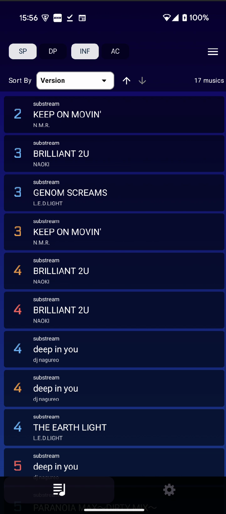
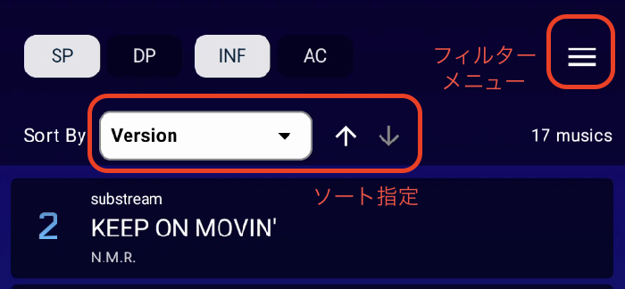
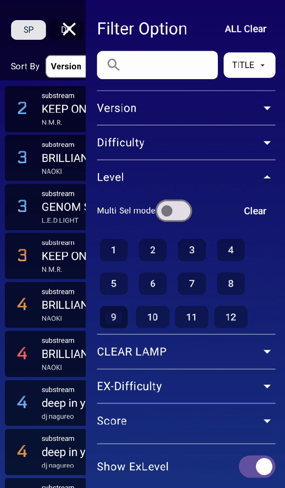
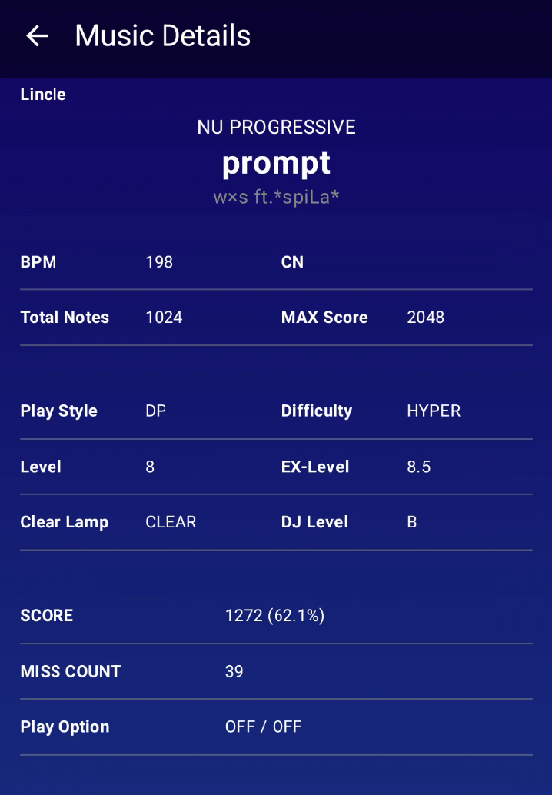
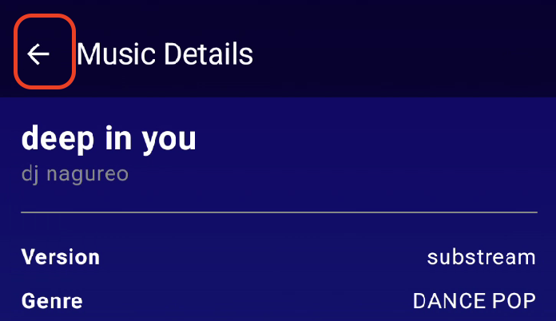
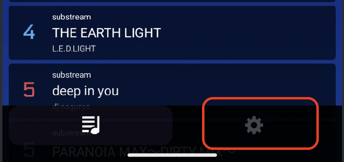
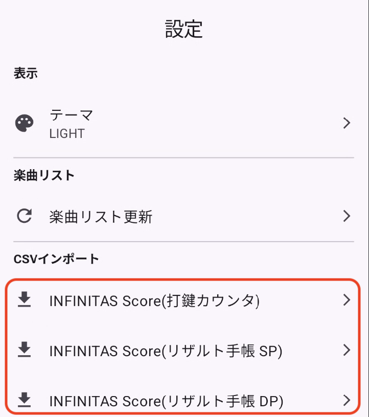
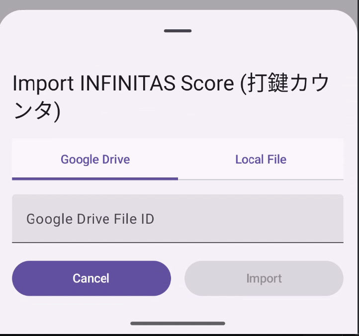
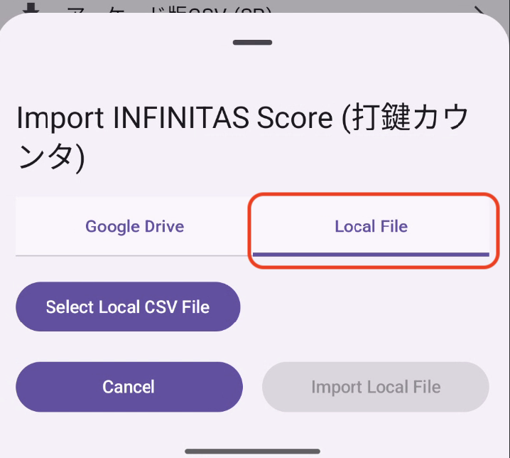

<link rel="stylesheet" href="assets/callouts.css">

# TrackBrowser テスト版ご利用ガイド

この度は、開発中のアプリ「TrackBrowser」のテストにご協力いただき、誠にありがとうございます。
このアプリは、音楽ゲーム「beatmania IIDX」の楽曲リストをより見やすく管理するために開発されました。

このガイドでは、アプリのインストール方法から基本的な使い方、そしてアプリ開発者が特に知りたいご意見（フィードバック）の観点についてご説明します。
専門的な知識は一切不要です。「使いやすいか」「わかりにくいところはないか」といった、率直なご感想をお聞かせください。

## 1. アプリのインストール方法 (Android)

このたび Google Play ストアにアプリを公開するために、  **テスト参加者が 12 人以上・14日間必要**となっています。  ご協力いただけますと大変助かります。  

1. ~~以下のリンクをスマホで開いてください~~  
   _リンク公開準備出来次第、お知らせします！！_ 

2. 表示されたページで **「参加する（オプトイン）」** をタップします  

3. Google アカウントでログインを求められた場合は、  
   普段お使いの Google アカウントでログインしてください  

4. これで **参加完了** です   
   - アプリをインストールしなくても条件は満たせます  
   - 14日間「参加状態」を維持していただければ大丈夫です  

---
###  実際にアプリをインストールして試す

1. 上記の手順で「参加する」を押したあと、画面に **「Google Play でアプリを入手」** のリンクが表示されます  

2. そこから Google Play を開き、通常のアプリと同じようにインストールできます 

3. アプリはテスト版のため、正式公開後にアップデートが必要になる場合があります  

4.  インストールが完了したら、「開く」をタップしてアプリを起動できます。

--- 
## 2. アプリの基本的な使い方

このアプリは、大きく分けて「楽曲リスト画面」と「楽曲詳細画面」の2つの画面で構成されています。

### 楽曲リスト画面

*   **何ができる？**: 保存されている楽曲のスコアデータが一覧で表示されます。上下にスクロールして、楽曲を見ることができます。

    

*   **操作方法**:
    1.  画面を上下に指でなぞる（スワイプする）と、リストをスクロールできます。
    2.  画面の上部には、リストの並び順を変えたり、特定の条件で絞り込んだりするためのボタンがあります。色々な条件で並び替えてみてください。

    

    

### 楽曲詳細画面

*   **何ができる？**: 楽曲リストで気になる曲をタップすると、その曲のさらに詳しい情報（正式な曲名、アーティスト名、BPM、あなたのスコア詳細など）を見ることができます。

*   **操作方法**:
    1.  楽曲リスト画面で、見たい楽曲の行をタップします。
    2.  詳細画面が表示されます。

    

    3.  リストに戻りたい場合は、画面左上の「←」のような戻るボタンをタップするか、スマートフォン本体の「戻る」操作（画面の端からスワイプするジェスチャーなど）を行ってください。

    

### 設定画面 - スコアCSV取込
 **開発者注: Google Driveにファイルを配置、設定するなどある程度Google Driveに関する操作知識が必要になります。不明点はお問い合わせください**

*   **何ができる？**:  [打鍵カウンター](https://github.com/dj-kata/inf_daken_counter_obsw), または[リザルト手帳](https://github.com/kaktuswald/inf-notebook/wiki) で出力したCSV、または公式サイトで取得(プレミアムメンバーのみ)できるCSVを取込み、楽曲リスト上でクリア状況、DJ LEVELなどを確認できるようになります。

*   **操作方法**(打鍵カウンターの場合):
    1.  画面下部の歯車マークをタップして、設定画面に移動します。
       

    2.  `Import INFINITAS Scores`をタップします
       (リザルト手帳はSP.csv と DP.csvで分かれて出力される為、目的のPlayStyleに合わせた項目をタップしてください。)
       

    3. 画面下部に、スコアCSVインポート画面が表示されます。 `Google Drive File ID`の部分に、予め用意したGoogle Drive配置済み、かつ `リンクを知っている全員`に共有設定されているCSVファイルのURLを入力します。
       

    4. 端末内に保存したファイルを取り込むことも可能です。`Local File`をタップしローカルファイル取込画面に切り替え `Select Local CSV File`より対象のCSVを選択します。  
       

    5. `Import`ボタンをタップし、取込を開始します。暫くすると、楽曲リスト画面にスコア情報が反映されます。

## 3. フィードバックのお願い

実際にアプリを触っていただき、以下の観点でご意見・ご感想をいただけますと大変助かります。
「こうだったらもっと良いのに」「ここが分かりにくかった」など、どんな些細なことでも構いません。

### A. 全体的な使い心地について

*   アプリを最初に起動したとき、どう感じましたか？（例：文字や色は見やすいか、デザインは好きか、など）
*   全体を通して、操作に迷うことはありませんでしたか？
*   「こう操作すれば、こうなるだろう」という予想通りにアプリは動きましたか？

### B. 各画面について

*   **楽曲リスト画面**:
    *   楽曲のリストはパッと見て分かりやすいですか？
    *   並び替えや絞り込みの機能は、すぐに使い方が分かりましたか？ また、使ってみて便利だと感じましたか？
    *   「こんな条件で並び替えたい／絞り込みたい」といった希望はありますか？

*   **楽曲詳細画面**:
    *   表示されている情報（スコア、クリアランプなど）は分かりやすいですか？
    *   「この曲について、こんな情報も表示されたら嬉しい」といった項目はありますか？

### C. 問題点・改善点について

*   操作中にアプリが突然終了したり、動きが止まったりすることはありましたか？
    *   もしあれば、どのような操作をしていた時か教えていただけると幸いです。
*   文字が枠からはみ出していたり、ボタンが押しにくかったり、表示がおかしいと感じる部分はありましたか？
*   「もっとこうだったら使いやすいのに」「こんな機能があったら嬉しい」といったアイデアがあれば、ぜひお聞かせください。

---

ご協力に心より感謝申し上げます。いただいたご意見は、今後の開発の参考にさせていただきます。

